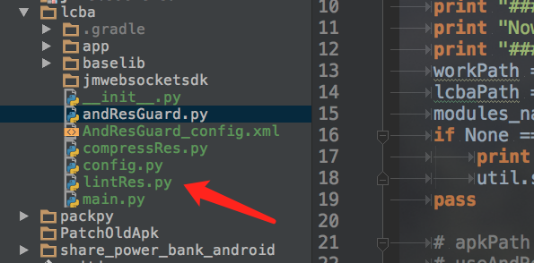
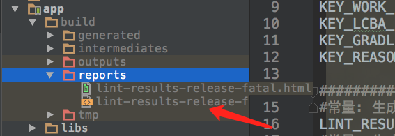
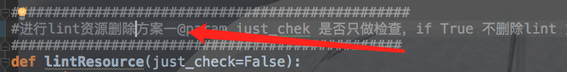
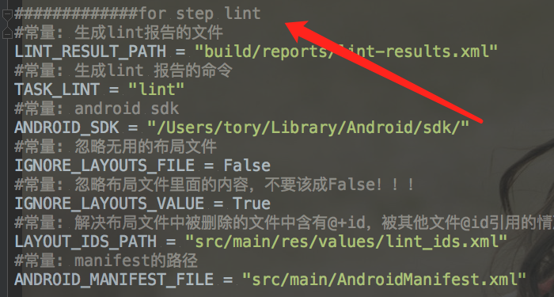
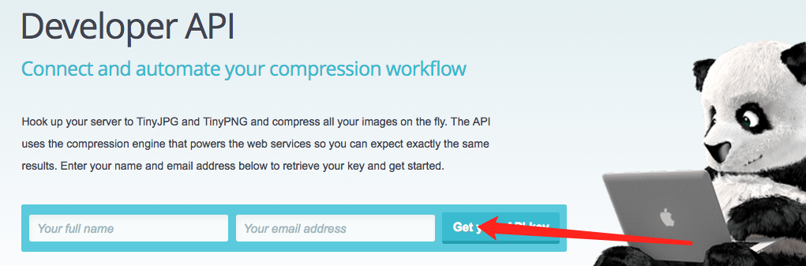

#LCBA version 0.1.5
*LCBA is a wrapper around dulwich. It provides an easy and familiar interface to git.
*It's pure python (no dependency on the ``git`` binary) and has no other dependencies besides
    the python stdlib, dulwich and paramiko (optional).

##有哪些功能

1，对android资源的自动化优化，并解决若干lint及lint删除资源和内容引起的问题;

2，并且我们还实现了对图片资源的压缩，极大的降低了内存使用空间，支持增量和自动化动化的压缩出处理，支持对apk进行资源混淆以再次节省空间；

3，支持模块化的pip更新方式，模块化以便移植，未来还将自持ios的图片压缩；

##怎样使用

*核心包我们已经更新到pip服务器，最新版本0.1.5

*安装依赖

    >>1).pip install lxml 
    >>2).pip install lcba
    >>3).pip install tinify
    >>4).brew install 7za （如果你不使用andResGuard对apk资源进行混淆可以不用安装）

##步骤
1,拷贝examples下面的代码到你的工作目录;

2,lint 删除资源

    *使用lint工具来读区 ./gradlew lint 生成的lint报告并调用lcba模块进行处理

    **如果你使用我们的方案一自己定义文件工程位置

    **请配置config.py 的lint配置

    **如果你使用我们的方案二会自动在工程中寻找这些参数文件

3,对图片进行压缩

    *对比了几种压缩的sdk，我们使用了tinypng的sdk，原因是它是在线的，不占用本地空间
首先你要到[tinypng](https://tinypng.com/developers)申请一些列的apikey,如图所示;

tinypng每个帐号单月500张的限制，so 多申请点;

后期有好的，我们会及时更换sdk

#bug 反馈请联系我

邮件:feiy1@jumei.com

QQ:289804201