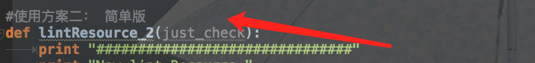
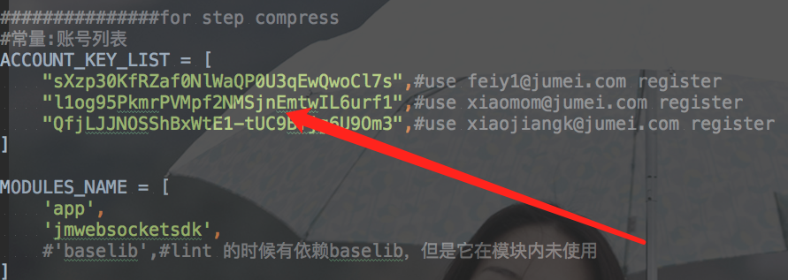
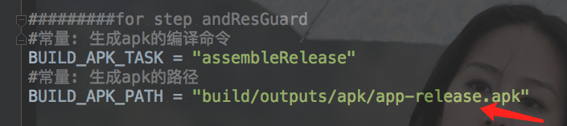
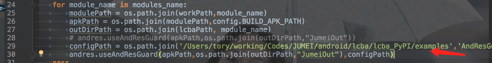

#FineResource version 0.1.6

*LCBA is a fineresource project use lint delete unUsed file and value. And this we will compress the picture for
          save the disk.

##有哪些功能

1，对android资源的自动化优化，并解决若干lint及lint删除资源和内容引起的问题;

2，并且我们还实现了对图片资源的压缩，极大的降低了内存使用空间，支持增量和自动化动化的压缩出处理，支持对apk进行资源混淆以再次节省空间；

3，支持模块化的pip更新方式，模块化以便移植，未来还将自持ios的图片压缩；

##怎样使用

*FineResources 依赖我们的核心包lcba我们已经更新到pip服务器，最新版本0.1.6

*安装依赖

    >>1).pip install lxml 
    >>2).pip install lcba(核心模块)
    >>3).pip install tinify
    >>4).brew install p7zip （如果你不使用andResGuard对apk资源进行混淆可以不用安装）

##步骤
1,拷贝examples下面的代码到你的工作目录;

2,lint 删除资源

    *使用lint工具来读区 ./gradlew lint 生成的lint报告并调用lcba模块进行处理

    **如果你使用我们的方案一自己定义文件工程位置

    **请配置config.py 的lint配置

    **如果你使用我们的方案二会自动在工程中寻找这些参数文件

    **运行:python lintRes.py

3,对图片进行压缩

    **对比了几种压缩的sdk，我们使用了tinypng的sdk，原因是它是在线的，不占用本地空间
首先你要到[tinypng](https://tinypng.com/developers)申请一些列的apikey,如图所示;

tinypng每个帐号单月500张的限制，so 多申请点;

    **运行python compressRes.py

后期有好的压缩sdk，我们会及时更换。

4,修改config.py来压缩图片，其中模块是你要处理的模块

5,使用AndResGuard来混淆你的apk资源

    **修改你的config.py

    **lcba模块内置了jar包和配置文件，如果你想用自己的配置文件

    **运行python andResGurad.py

更多andResGuard 配置修改see:[andRes_config](https://github.com/shwenzhang/AndResGuard/blob/master/doc/how_to_work.zh-cn.md)

6,如果你都修改好了，可以把这几步一起跑下

    **运行:python main.py

#bug 反馈请联系我

邮件:feiy1@jumei.com

QQ:289804201